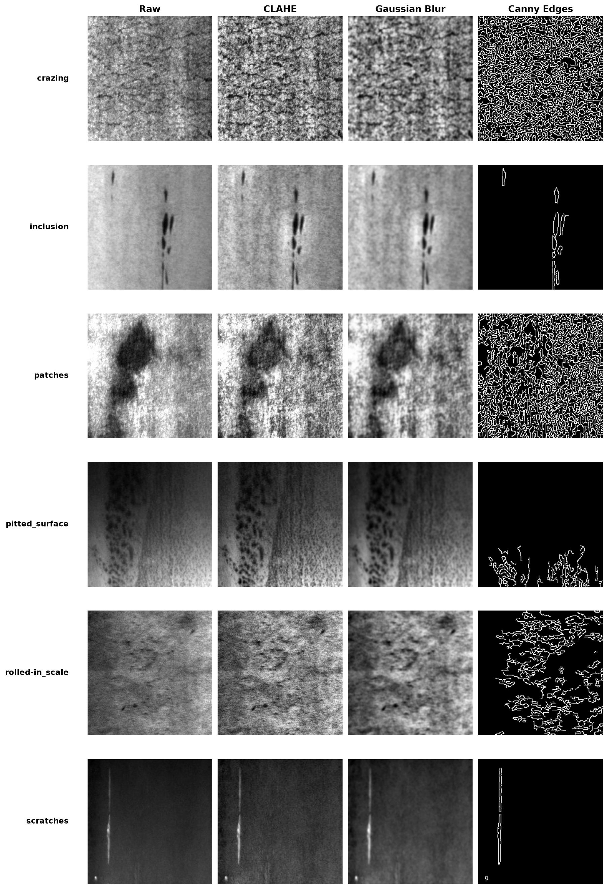
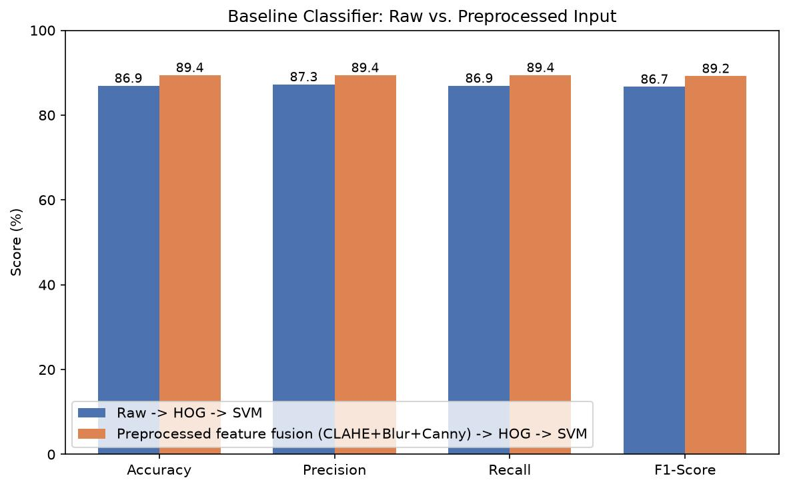
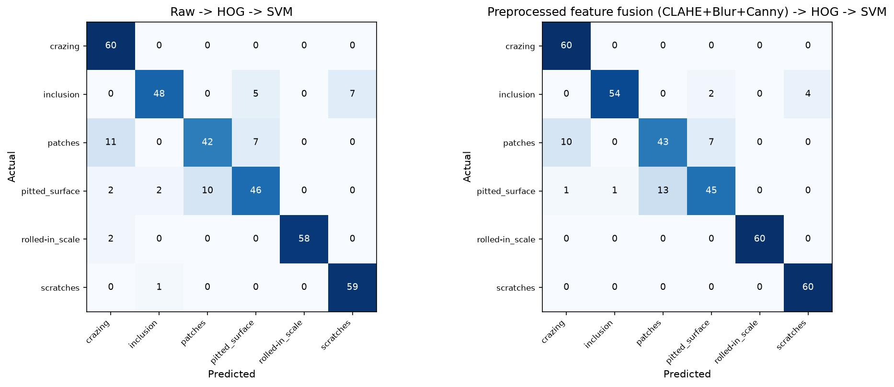
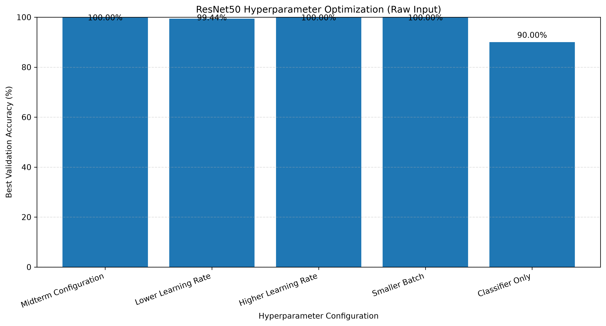
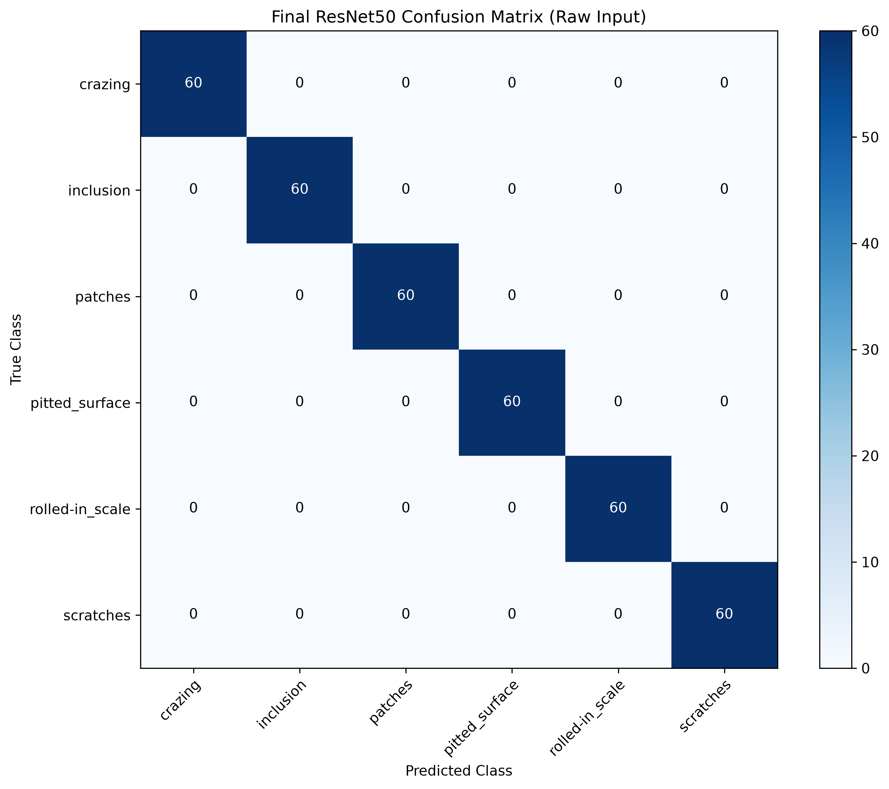
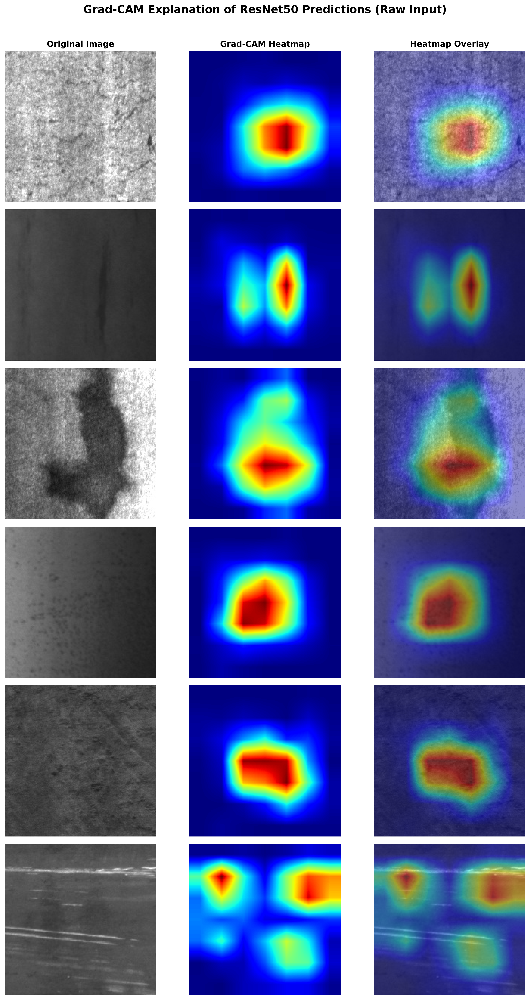
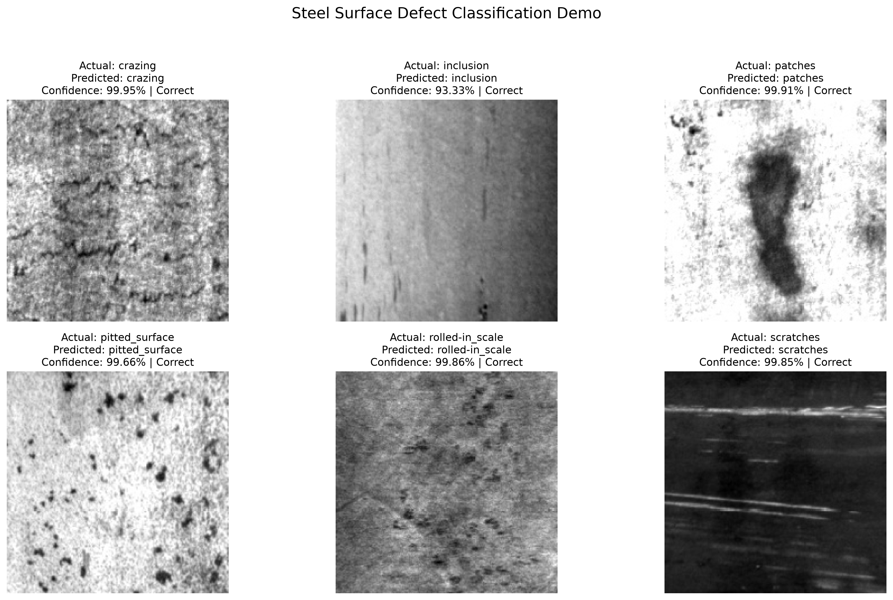

# Steel Surface Defect Detection & Classification

### CS898BA – Image Analysis and Computer Vision

## Final Project

**Student:** Chiranjeevi Venkata Shiva Ruthvik Savaram

---

# Table of Contents

- [Project Overview](#project-overview)
- [Project Objectives](#project-objectives)
- [Dataset](#dataset)
- [Condensed Literature Review](#condensed-literature-review)
- [Development Environment](#development-environment)
- [Computer Vision Pipeline](#computer-vision-pipeline)
- [Tasks Completed](#tasks-completed)
  - [1. Image Preprocessing](#1-image-preprocessing)
  - [2. Traditional Machine Learning Baseline](#2-traditional-machine-learning-baseline)
  - [3. Transfer Learning](#3-transfer-learning)
  - [4. Hyperparameter Optimization](#4-hyperparameter-optimization)
  - [5. Final Model Evaluation](#5-final-model-evaluation)
  - [6. Grad-CAM Explainability](#6-grad-cam-explainability)
  - [7. Visualization](#7-visualization)
  - [8. Virtual Demonstration](#8-virtual-demonstration)
- [Experimental Results](#experimental-results)
- [Observations](#observations)
- [Roadblocks & Pivots](#roadblocks--pivots)
- [Repository Structure](#repository-structure)
- [Running the Project](#running-the-project)
- [Technologies Used](#technologies-used)
- [Conclusion](#conclusion)

---

# Project Overview

This repository contains my **Final Project** submission for **CS898BA – Image Analysis and Computer Vision**. The project focuses on automated steel surface defect classification using both traditional machine learning and deep learning techniques. Building upon the work completed during the midterm milestone, the final project implements a complete computer vision pipeline including image preprocessing, a traditional machine learning baseline, transfer learning using ResNet50, hyperparameter optimization, comprehensive model evaluation, and Grad-CAM visualization for model explainability.

The project uses the **NEU Surface Defect Database (NEU-DET)**, a benchmark dataset containing six categories of steel surface defects commonly used for evaluating image classification algorithms.

The completed pipeline demonstrates the full workflow of a practical computer vision system, beginning with raw image preprocessing and ending with optimized deep learning classification and visual model interpretation.

---

# Project Objectives

The primary objectives of this project are:

- Develop a reusable image preprocessing pipeline.
- Build a traditional machine learning baseline.
- Implement a deep learning solution using transfer learning.
- Compare the performance of raw and preprocessed image inputs.
- Perform hyperparameter optimization to improve model performance.
- Evaluate the final model using multiple computer vision metrics.
- Visualize model predictions using Grad-CAM.
- Develop a complete and reproducible computer vision pipeline.
- Demonstrate the final trained model processing representative validation images in batch format.

---

# Dataset

**Dataset:** NEU Surface Defect Database (NEU-DET)

The dataset contains **1,800 grayscale steel surface images**, with **300 images for each of the six defect classes**:

- Crazing
- Inclusion
- Patches
- Pitted Surface
- Rolled-in Scale
- Scratches

The dataset was collected from real steel manufacturing processes and is widely used as a benchmark for evaluating automated surface defect classification algorithms.

The provided training and validation split supplied with the dataset was used for all experiments. The complete dataset is included in this repository to allow the project to be reproduced without any additional downloads.

---

# Condensed Literature Review

Automated steel surface defect classification has been widely studied using both traditional machine learning and deep learning approaches. Earlier research commonly relied on handcrafted texture descriptors such as Histogram of Oriented Gradients (HOG), Local Binary Patterns (LBP), and Gray Level Co-occurrence Matrix (GLCM), together with classifiers such as Support Vector Machines (SVMs). These methods are computationally efficient and perform well when combined with appropriate image preprocessing techniques.

Recent studies have shown that convolutional neural networks, particularly transfer learning models such as ResNet50, achieve significantly higher classification accuracy by automatically learning hierarchical image features from large datasets. However, the influence of preprocessing on pretrained deep learning models remains an active area of research.

Based on these findings, this project implements both a traditional HOG + SVM baseline and a ResNet50 transfer learning model while investigating how image preprocessing influences the performance of each approach.

---

# Development Environment

### Software

- Python 3.13
- Windows 11
- Visual Studio Code
- Git
- GitHub

### Primary Libraries

- OpenCV
- NumPy
- Matplotlib
- scikit-image
- scikit-learn
- PyTorch
- Torchvision

---

# Computer Vision Pipeline

The overall workflow implemented in this project is illustrated below.

```text
                 Raw Steel Surface Images
                           │
                           ▼
        Image Preprocessing (CLAHE + Gaussian Blur + Canny)
                           │
             ┌─────────────┴─────────────┐
             │                           │
             ▼                           ▼
     HOG Feature Extraction         ResNet50
          + SVM Baseline        Transfer Learning
             │                           │
             ▼                           ▼
      Baseline Results       Hyperparameter Optimization
             │                           │
             └─────────────┬─────────────┘
                           ▼
                Final Model Evaluation
                           │
             ┌─────────────┴─────────────┐
             │                           │
             ▼                           ▼
     Grad-CAM Visualization      Virtual Demonstration
```

The pipeline integrates both traditional computer vision techniques and modern deep learning methods, allowing direct comparison between handcrafted feature-based classification and transfer learning.

---

# Tasks Completed

## 1. Image Preprocessing

Implemented a reusable preprocessing pipeline consisting of:

- CLAHE (Contrast Limited Adaptive Histogram Equalization)
- Gaussian Blur
- Canny Edge Detection

The preprocessing pipeline enhances local contrast, suppresses image noise, and highlights defect boundaries before feature extraction and classification. These preprocessing stages were reused throughout the project for qualitative visualization and comparative experiments.

### Preprocessing Pipeline

<p align="center">
    
</p>

<p align="center">
<b>Figure 1.</b> Comparison of the preprocessing pipeline showing the original image, CLAHE enhancement, Gaussian smoothing, and Canny edge detection.
</p>

---

## 2. Traditional Machine Learning Baseline

Implemented a complete HOG + SVM classification pipeline.

The baseline includes:

- HOG feature extraction
- Feature fusion using HOG descriptors extracted from both the preprocessed grayscale image and the Canny edge image
- Support Vector Machine (SVM) classifier
- Performance evaluation using multiple classification metrics
- Comparison between raw and preprocessed image inputs

This baseline establishes a strong classical computer vision reference before introducing deep learning methods.

### Baseline Performance Comparison

<p align="center">
    
</p>

<p align="center">
<b>Figure 2.</b> Performance comparison of the HOG + SVM classifier using raw and preprocessed image inputs.
</p>

### Baseline Confusion Matrices

<p align="center">
    
</p>

<p align="center">
<b>Figure 3.</b> Confusion matrices illustrating the classification performance of the traditional HOG + SVM baseline.
</p>

---

## 3. Transfer Learning

Implemented a ResNet50 transfer learning framework.

The implementation includes:

- Custom dataset loader
- Image preprocessing and normalization
- Transfer learning using an ImageNet-pretrained ResNet50 model
- Fine-tuning of the final residual block together with the fully connected classification layer
- Performance evaluation using both raw grayscale images and custom three-channel preprocessed images
- Automatic checkpoint saving during training
- Validation accuracy monitoring throughout training

Compared with the traditional HOG + SVM baseline, the ResNet50 model achieved substantially higher classification performance while requiring minimal handcrafted feature engineering.

The trained ResNet50 model serves as the primary deep learning framework used throughout the remainder of the project, including hyperparameter optimization, final evaluation, and Grad-CAM visualization.

---

## 4. Hyperparameter Optimization

To further improve the performance of the transfer learning model, multiple hyperparameter configurations were evaluated using the ResNet50 architecture. The objective was to investigate how different learning rates, batch sizes, and fine-tuning strategies influenced validation performance while maintaining stable and reproducible training.

The following hyperparameters were investigated:

- Learning Rate
- Batch Size
- Fine-tuning Strategy

The evaluated configurations are summarized below.

| Configuration | Learning Rate | Batch Size | Fine-tuning Strategy | Validation Accuracy |
|---------------|--------------:|-----------:|----------------------|--------------------:|
| Baseline | 0.0001 | 32 | Layer4 + FC | **100.00%** |
| Lower Learning Rate | 0.00005 | 32 | Layer4 + FC | **99.44%** |
| Higher Learning Rate | 0.0002 | 32 | Layer4 + FC | **100.00%** |
| Smaller Batch | 0.0001 | 16 | Layer4 + FC | **100.00%** |
| Classifier Only | 0.0001 | 32 | Fully Connected Layer | **90.00%** |

Three different configurations achieved a validation accuracy of **100%**. The baseline configuration (learning rate **0.0001**, batch size **32**, and fine-tuning of the final residual block together with the fully connected layer) was selected as the final model because it achieved identical performance while maintaining a simple and reproducible training configuration.

### Hyperparameter Comparison

<p align="center">
    
</p>

<p align="center">
<b>Figure 4.</b> Comparison of different ResNet50 hyperparameter configurations evaluated during model optimization.
</p>

---

## 5. Final Model Evaluation

After selecting the final configuration, the optimized ResNet50 model was evaluated on the validation dataset using multiple computer vision evaluation metrics.

The evaluation included:

- Overall Accuracy
- Precision
- Recall
- Macro F1-score
- Weighted F1-score
- Confusion Matrix
- Classification Report

### Final Evaluation Results

| Metric | Value |
|---------|------:|
| Validation Accuracy | **100.00%** |
| Macro Precision | **1.0000** |
| Macro Recall | **1.0000** |
| Macro F1-score | **1.0000** |
| Weighted Precision | **1.0000** |
| Weighted Recall | **1.0000** |
| Weighted F1-score | **1.0000** |

The optimized ResNet50 model correctly classified all **360 validation images**, producing a perfect confusion matrix without any misclassified samples.

Although the model achieved zero misclassifications on the 360-image validation set, this result should be interpreted as performance on this specific holdout set rather than proof of perfect generalization. Since three hyperparameter configurations achieved the same validation accuracy, the selected configuration was chosen for its simplicity and reproducibility.

### Final Confusion Matrix

<p align="center">
    
</p>

<p align="center">
<b>Figure 5.</b> Confusion matrix of the optimized ResNet50 model showing perfect classification performance on the validation dataset.
</p>

---

## 6. Grad-CAM Explainability

To better understand how the trained ResNet50 model makes classification decisions, Gradient-weighted Class Activation Mapping (Grad-CAM) was implemented.

Grad-CAM generates activation heatmaps that highlight the image regions contributing most strongly to the model's predictions, allowing qualitative inspection of the learned visual representations.

For each defect class, the visualization includes:

- Original image
- Grad-CAM activation heatmap
- Overlay of the activation heatmap on the original image
- Predicted class and confidence score

Grad-CAM visualizations showed clear correspondence between the model's attention and visible defect regions for localized defect types such as patches and scratches, with partial correspondence for inclusion. For more diffuse, texture-based defects such as crazing, pitted surface, and rolled-in scale, the activation maps highlighted broader image regions rather than sharply localized features. This behavior is consistent with both the distributed visual characteristics of these defect classes and the coarse spatial resolution of Grad-CAM generated from deeper ResNet50 feature maps. Therefore, the visualizations provide partial, class-dependent qualitative support for the model's learned representations rather than uniform confirmation across all six classes.

### Grad-CAM Results

<p align="center">
    
</p>

<p align="center">
<b>Figure 6.</b> Grad-CAM visualizations for one representative image from each defect class showing the regions that contributed most strongly to the model's predictions.
</p>

---

## 7. Visualization

Several visualizations were generated throughout the project to document each stage of the computer vision pipeline and summarize the experimental results.

The generated figures include:

- Preprocessing pipeline comparison
- Baseline classifier metric comparison
- Baseline confusion matrices
- Hyperparameter optimization comparison
- Final confusion matrix
- Grad-CAM visualizations
- Virtual demonstration prediction summary

These visualizations provide both qualitative and quantitative evidence supporting the effectiveness of the implemented computer vision pipeline while making the experimental results easier to interpret.

---

## 8. Virtual Demonstration

To satisfy the batch-format virtual demonstration requirement, `demo_pipeline.py` loads the final tuned ResNet50 checkpoint and runs inference on one representative validation image from each of the six defect classes. The script displays the actual class, predicted class, confidence score, and prediction result for each image while also saving a visual summary.

No additional model training is performed during the demonstration.

**Run:**

```bash
python src/demo_pipeline.py
```
**Result: 6/6 correct predictions**

| Class | Predicted | Confidence | Result |
|---|---|---:|---|
| crazing | crazing | 99.95% | Correct |
| inclusion | inclusion | 93.33% | Correct |
| patches | patches | 99.91% | Correct |
| pitted_surface | pitted_surface | 99.66% | Correct |
| rolled-in_scale | rolled-in_scale | 99.86% | Correct |
| scratches | scratches | 99.85% | Correct |

<p align="center">
    
</p>

<p align="center">
<b>Figure 7.</b> Demonstration of the trained pipeline correctly classifying one sample image from each defect class, with prediction confidence shown for each.
</p>

---

# Experimental Results

## Traditional Machine Learning Baseline

The HOG + SVM classifier was evaluated using both raw grayscale images and the proposed preprocessing pipeline.

| Model | Input | Accuracy |
|--------|-------|----------|
| HOG + SVM | Raw Images | **86.94%** |
| HOG + SVM | Preprocessed Feature Fusion | **89.44%** |

The preprocessing pipeline improved the traditional machine learning baseline by approximately **2.5 percentage points**, demonstrating that handcrafted preprocessing techniques remain beneficial when using feature-based classifiers.

---

## Initial Transfer Learning Results

The ResNet50 transfer learning model was evaluated using both raw grayscale images and custom three-channel preprocessed images.

| Model | Input | Accuracy |
|--------|-------|----------|
| ResNet50 | Raw Images | **99.72%** |
| ResNet50 | Preprocessed Images | **99.44%** |

The transfer learning model substantially outperformed the traditional HOG + SVM baseline under both input conditions, demonstrating the effectiveness of deep convolutional neural networks for automated steel surface defect classification.

---

## Hyperparameter Optimization Results

The final hyperparameter experiments are summarized below.

| Configuration | Learning Rate | Batch Size | Fine-tuning Strategy | Validation Accuracy |
|---------------|--------------:|-----------:|----------------------|--------------------:|
| Midterm Configuration | 0.0001 | 32 | Layer4 + FC | **100.00%** |
| Lower Learning Rate | 0.00005 | 32 | Layer4 + FC | **99.44%** |
| Higher Learning Rate | 0.0002 | 32 | Layer4 + FC | **100.00%** |
| Smaller Batch | 0.0001 | 16 | Layer4 + FC | **100.00%** |
| Classifier Only | 0.0001 | 32 | Fully Connected Layer | **90.00%** |

Three different configurations achieved perfect validation accuracy, demonstrating that the model is relatively robust to moderate hyperparameter changes.

---

## Final Model Performance

The optimized ResNet50 model achieved the following performance on the validation dataset.

| Metric | Value |
|---------|------:|
| Validation Accuracy | **100.00%** |
| Macro Precision | **1.0000** |
| Macro Recall | **1.0000** |
| Macro F1-score | **1.0000** |
| Weighted Precision | **1.0000** |
| Weighted Recall | **1.0000** |
| Weighted F1-score | **1.0000** |

The optimized model correctly classified all **360 validation images**, producing a perfect confusion matrix with no classification errors.

---

# Observations

The completed project produced several important observations.

- The proposed preprocessing pipeline improved the HOG + SVM baseline by approximately **2.5 percentage points** over the raw-image baseline.
- Transfer learning using ResNet50 significantly outperformed the traditional machine learning approach.
- Raw grayscale images slightly outperformed the custom three-channel preprocessing when using ResNet50, suggesting that pretrained ImageNet features generalize effectively to this dataset.
- Hyperparameter optimization demonstrated that multiple training configurations were capable of achieving perfect validation accuracy, indicating that the model is relatively robust to moderate hyperparameter variations.
- Fine-tuning the final residual block together with the fully connected layer consistently outperformed training only the classifier layer.
- Grad-CAM visualizations provided class-dependent qualitative evidence: localized defects such as patches and scratches showed strong correspondence with visible defect regions, while diffuse texture-based classes produced broader and less precisely localized activation patterns.
- The virtual demonstration showed that the complete inference pipeline correctly classified representative images from all six defect classes. Inclusion produced the lowest confidence score at **93.33%**, consistent with it being one of the more visually ambiguous defect classes observed during the project.

---

# Roadblocks & Pivots

Several challenges were encountered during the development of this project.

One challenge involved ensuring that the preprocessing implementation matched the workflow proposed in the project presentation. Initially, the traditional machine learning baseline only used CLAHE and Gaussian Blur before feature extraction. The implementation was later revised so that Canny edge information also contributed to the extracted HOG descriptors through feature fusion, making the implementation consistent with the proposed preprocessing pipeline.

Another challenge involved configuring and validating the ResNet50 transfer learning pipeline. Multiple experiments were conducted to evaluate different learning rates, batch sizes, and fine-tuning strategies before selecting the final model configuration.

Implementing Grad-CAM also required interpreting activation maps across defect types with very different visual characteristics — localized defects like patches and scratches produced clearly interpretable heatmaps, while diffuse texture-based defects were harder to validate visually, since the activation regions were broader and less tied to a specific visible feature.

Addressing these challenges resulted in a complete, robust, and reproducible computer vision pipeline that satisfies the objectives of the final project.

---

# Repository Structure

```text
SteelDefect_CS898BA_Project/
│
├── data/
│   ├── train/
│   └── validation/
│
├── src/
│   ├── preprocessing.py
│   ├── baseline_classifier.py
│   ├── resnet50_transfer.py
│   ├── hyperparameter_tuning.py
│   ├── evaluate_model.py
│   ├── gradcam_visualization.py
│   ├── demo_pipeline.py
│   ├── generate_preprocessing_samples.py
│   └── generate_results_plots.py
│
├── outputs/
│   ├── plots/
│   │   ├── preprocessing_pipeline_comparison.jpg
│   │   ├── baseline_metric_comparison.jpg
│   │   └── confusion_matrices.jpg
│   │
│   ├── final_plots/
│   │   ├── resnet50_hyperparameter_comparison_raw.png
│   │   └── final_resnet50_confusion_matrix_raw.png
│   │
│   ├── gradcam/
│   │   └── gradcam_all_classes_raw.png
│   │
│   ├── final_results/
│   │   ├── best_tuned_resnet50_raw.pth
│   │   ├── final_classification_report_raw.txt
│   │   ├── final_evaluation_results_raw.json
│   │   └── hyperparameter_tuning_results_raw.json
│   │
│   └── demo/
│       └── demo_predictions_raw.png
│
├── README.md
├── AI_Log.md
└── requirements.txt
```

---

# Running the Project

## 1. Clone the repository

```bash
git clone https://github.com/shvruthvik/ChiranjeeviSavaram-Y247K345-CS898BA-Project.git

cd ChiranjeeviSavaram-Y247K345-CS898BA-Project
```

## 2. Install dependencies

```bash
pip install -r requirements.txt
```

## 3. Execute the pipeline

Run the scripts in the following order to reproduce the complete computer vision pipeline.

```bash
# Step 1 - Generate preprocessing outputs
python src/preprocessing.py

# Step 2 - Train and evaluate the HOG + SVM baseline
python src/baseline_classifier.py

# Step 3 - Train the ResNet50 transfer learning model
python src/resnet50_transfer.py

# Step 4 - Perform hyperparameter optimization
python src/hyperparameter_tuning.py

# Step 5 - Evaluate the final trained model
python src/evaluate_model.py

# Step 6 - Generate Grad-CAM visualizations
python src/gradcam_visualization.py

# Step 7 - Run the virtual demonstration
python src/demo_pipeline.py
```

The generated plots, evaluation metrics, confusion matrices, Grad-CAM visualizations, trained model outputs, and virtual demonstration results will automatically be saved inside the corresponding folders within the **outputs/** directory.

---

# Technologies Used

### Programming Language

- Python

### Computer Vision & Deep Learning

- OpenCV
- PyTorch
- Torchvision

### Machine Learning

- scikit-learn
- scikit-image
- NumPy

### Visualization

- Matplotlib

### Development Tools

- Git
- GitHub
- Visual Studio Code

---

# Conclusion

This project successfully developed a complete computer vision pipeline for automated steel surface defect classification using both traditional machine learning and deep learning techniques.

Beginning with image preprocessing, the project implemented a reusable enhancement pipeline using CLAHE, Gaussian Blur, and Canny Edge Detection. A traditional HOG + SVM classifier established a strong baseline, demonstrating that preprocessing improves handcrafted feature-based classification performance.

Building upon this baseline, a ResNet50 transfer learning framework was developed and systematically optimized through hyperparameter tuning. Multiple training configurations were evaluated, with three configurations achieving **100% validation accuracy**. The baseline configuration was selected because it achieved identical performance while maintaining a simple and reproducible training setup.

The final model achieved:

- **100.00% Validation Accuracy**
- **1.0000 Macro Precision**
- **1.0000 Macro Recall**
- **1.0000 Macro F1-score**
- **1.0000 Weighted F1-score**

Grad-CAM visualization was incorporated to provide qualitative explanations of the model's predictions. The generated activation maps provided partial, class-dependent insight into the model's decision process. Localized defects showed clearer correspondence between attention and visible defect regions, while diffuse texture-based defects produced broader activation patterns.

Finally, a virtual demonstration confirmed that the complete computer vision pipeline successfully classified representative validation images from all six defect classes, providing an end-to-end demonstration of the deployed inference workflow.

Overall, this project satisfies the objectives of designing, implementing, optimizing, evaluating, and interpreting a complete computer vision solution for automated steel surface defect classification. The completed pipeline demonstrates how classical computer vision techniques and modern deep learning approaches can effectively complement one another to achieve highly accurate and interpretable image classification results.

---

# Acknowledgements

This project was completed as part of **CS898BA – Image Analysis and Computer Vision** at **Wichita State University**.

The implementation makes use of the publicly available **NEU Surface Defect Database (NEU-DET)** and open-source computer vision and deep learning libraries, including OpenCV, PyTorch, Torchvision, and scikit-learn.